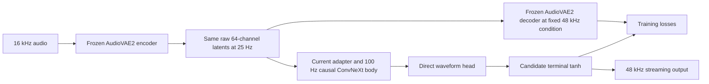

# AudioVAE2 techniques for a lightweight causal decoder

The recommended design combines the existing Supertonic-style low-rate synthesis body with the AudioVAE2 encoder contract, bounded waveform output, and selected audio reconstruction methods. The first architecture candidate remains a trained terminal tanh. The most useful additional transfer is short-time spectral supervision, followed only if needed by a discriminator that can inspect complex spectra and frequency bands. These training methods do not add inference operations.

This is a source and design review. No model execution, new performance benchmark, training restart or source deployment was performed. Quality observations refer to saved evaluations, principally step 5,000; they are not a fresh measurement of the running continuation. The current decoder and training losses were left unchanged.

## Evidence and its limits

The teacher loader pins OpenBMB source revision `f772e498a45fbb5fb8e13fbf9b9c48be9fe33e69`, source SHA-256 `2efdff1708d8ec1471624aae6f232d0f933de26b788b6901c434246847e2d3a8`, and the original AudioVAE2 checkpoint SHA-256 `94b5d51e107e0507d4acc976cfdadb64edd6fd06d1f751dadbf2fd1594274bf1`. The review compares that source with the current student, teacher wrapper, reconstruction loss, discriminators, loss balancer and saved audit reports.

The official V2 report establishes the asymmetric 16 kHz encoder and 48 kHz decoder, 64-dimensional latents at 25 Hz, and rate-related architecture changes. The TTS backbone groups four latents into a 160 ms patch; that does not change the codec's underlying 40 ms latent interval. [VoxCPM2 technical report, section 3.2](https://arxiv.org/html/2606.06928v1#S3.SS2)

The complete V2 training recipe is not verified from the available official material. The authoritative earlier AudioVAE disclosure identifies DAC-style multiscale mel, adversarial, feature-matching and KL losses. A V2-specific issue reply describes further settings, but its author could not be authenticated as a project maintainer. Those settings are not treated as requirements here. [Earlier maintainer disclosure](https://github.com/OpenBMB/VoxCPM/issues/145#issuecomment-3767009845), [V2 discussion](https://github.com/OpenBMB/VoxCPM/issues/353#issuecomment-4913099637)

The released Supertonic 3 graph was matched to its official SHA-256 `085de76dd8e8d5836d6ca66826601f615939218f90e519f70ee8a36ed2a4c4ba`. Its architecture is directly inspectable, while the earlier Supertonic paper is not a full disclosure of the version 3 training program. [Released graph](https://huggingface.co/Supertone/supertonic-3/blob/main/onnx/vocoder.onnx), [graph comparison](../convnext-restart-plan/supertonic3-decoder-comparison.md)

## The proposed combination

Only the student branch is needed for decoder deployment. The target is the teacher's actual output from the same latent tensor. It is not a second target constructed by normalizing each waveform, changing latent coordinates or forcing a different sample-rate interface.

| Property or technique | Current status | Decision | Inference effect of proposed change |
|---|---|---|---|
| Raw posterior means and 64-channel interface | Preserved | Keep | None |
| 1,920 samples per latent and valid-length trimming | Preserved | Keep | None |
| Fixed 48 kHz teacher conditioning | Explicit in target generation | Keep; no extra student conditioning network needed | None |
| Low-rate causal ConvNeXt processing | Present | Keep | None |
| Terminal amplitude bound | Missing in student | Test trained tanh first | One pointwise output activation |
| Short-time spectral reconstruction | Current minimum window is 21.3 ms | Strongest next training refinement | None |
| Complex, bandwise spectral discriminator | Current MRD uses full-band log magnitude | Consider only after simpler changes | None |
| Local waveform-neighborhood filtering | No sample-rate filter after block projection | Reserve as a phase-artifact hypothesis | Small added convolution if eventually adopted |
| Startup padding convention | Teacher and student differ | Track separately; do not flip during this change | Export/state implications if changed |
| Weight normalization | Teacher uses it; student has its own normalization | No demonstrated need to transplant | Potentially removable, but changes training parameterization |
| High-rate residual/Snake stages | Intentionally absent | Do not restore the expensive stack | Would undermine the CPU objective |
| KL, random posterior samples and latent-cycle loss | Not part of current decoder objective | Do not add for this fixed-encoder contract | Unnecessary training complexity |

## What is already correctly adapted

The local teacher wrapper explicitly supplies unscaled posterior means, fixed 48 kHz conditioning and deterministic frozen targets. It encodes continuous utterances before selecting training regions. The student receives the same latent coordinates through an adapter that repeats all 64 dimensions into four internal phases with learned offsets. Real history and separate validity masks prevent padding and context from becoming scored reconstruction audio.

There is therefore no missing latent-matching loss between two separately generated latent representations. Both decoder branches already receive the same tensor. Re-encoding student output would introduce a different cycle-consistency objective: it would require 48-to-16 kHz conversion, and even the original teacher reconstruction need not re-encode to the exact original latent. That objective would need a teacher self-consistency baseline before it could be interpreted.

The existing student also has the main published Supertonic processing components: ten dilated causal ConvNeXt blocks, LayerNorm/GELU/channel mixing, calibrated normalization and a nonlinear direct-waveform head. The paper's decoder objective includes mel reconstruction, adversarial and feature matching. Its 190 ms adversarial crops match the current crop duration. These are not missing components. [Supertonic architecture and objective](https://arxiv.org/html/2503.23108v3#S3.SS1.SSS2)

The teacher's internal hidden channels and stages need not be reproduced to preserve the interface. Conversely, matching the encoder and waveform shape does not itself prove that the student has learned the teacher's synthesis quality. That must remain a measured acceptance condition.

## Terminal tanh: justified, with a narrow purpose

The exact AudioVAE2 decoder ends with Snake, a seven-tap causal convolution and tanh. Its convolutions use weight normalization and left zero padding; optional noise injection is disabled in the selected configuration. [Pinned implementation](https://github.com/OpenBMB/VoxCPM/blob/f772e498a45fbb5fb8e13fbf9b9c48be9fe33e69/src/voxcpm/modules/audiovae/audio_vae_v2.py#L310-L315)

The student's existing head is unbounded. A terminal tanh is a more direct way to adopt bounded output than introducing and tuning a separate peak penalty. It should be included during fine-tuning, using the existing cached post-tanh teacher waveform targets. The frozen encoder, teacher checkpoint, normalization calibration and causal state layout can remain unchanged.

This is not a transparent modification to a trained function: `tanh(0.9)` is approximately `0.716`. Applying it only at deployment would reduce loud amplitudes. The student must adapt its preceding activations, and the resulting waveform must be checked for loudness, transient fidelity and high-frequency quality. Saturation also reduces gradients near the bounds. There is no evidence that moving supervision to teacher pre-tanh activations would improve this task; it would add target preparation and a new objective. Recovering those activations with `atanh` is ill-conditioned near the limits.

For finite inputs, the function bounds output to the representable range around [-1, 1]. Floating-point results can equal exactly one. The current `abs >= 1` counter must therefore be retained as a saturation diagnostic and supplemented with a separate `abs > 1` overshoot count. A bound is a structural property, not a reconstruction-quality score.

Tanh adds no history, lookahead or output samples. At mono 48 kHz it performs 48,000 scalar evaluations per second of audio. This is an operation count, not a measured RTF claim. Batch, streaming, export and folded-normalization paths must use the same final operation.

For small signals, tanh is almost the identity. It will not remove the observed silence floor or repeating low-level residual. Its first comparison should leave the other losses unchanged, isolating its effect on peaks and amplitude fidelity.

## Short-time supervision: the strongest additional transfer

Current reconstruction uses FFT/window sizes 1,024, 2,048 and 4,096 at 48 kHz. These span 21.3, 42.7 and 85.3 ms, with quarter-window hops. They provide spectral detail over longer windows, but do not explicitly include a few-millisecond reconstruction window.

The older AudioVAE disclosure uses seven DAC scales from 32 to 2,048 samples with scale-dependent mel-band counts. DAC's paper connects short hops and multiscale reconstruction with rapid transient fidelity. Its exact numerical settings should be adapted to the student's output rate and reductions rather than copied as unexplained coefficients. [AudioVAE loss configuration](https://github.com/OpenBMB/VoxCPM/issues/145#issuecomment-3767009845), [DAC paper, sections 3.5 and 4.5](https://arxiv.org/html/2306.06546v2)

The proposed next refinement is to retain the current long windows and test a small number of shorter resolutions within the existing mel branch. FFT 256 and 512 at 48 kHz, for example, would add 5.3 and 10.7 ms windows. Those are starting candidates, not claimed V2 hyperparameters. Their mel-bin counts and normalization should be explicitly declared and checked so a new resolution does not accidentally dominate the loss.

This is relevant to laughter attacks, consonants and other rapid changes. It may also give better temporal localization of some residual errors. It does not, by itself, establish a cure for silence or phase errors. Direct waveform supervision still provides the absolute-amplitude and sample-alignment anchor.

All resolutions must score only actual valid regions, keep context excluded and reduce by valid elements. No inference Fourier transform is introduced. These transforms operate on generated and target audio only during training. A refinement of this existing loss is preferable to accumulating multiple special-purpose quiet, phase and peak penalties without evidence.

## A useful later discriminator option, and a copying hazard

The current MRD branch takes log-magnitude spectra. It therefore discards spectral phase in that branch. Waveform reconstruction and the period discriminator still supply time-domain information, so the student is not wholly unsupervised in phase.

DAC uses real and imaginary spectral channels and separate frequency bands. Its implementation also subtracts each clip's mean and peak-normalizes the clip before discriminator evaluation. [Official discriminator implementation](https://github.com/descriptinc/descript-audio-codec/blob/main/dac/model/discriminator.py)

A complex, bandwise discriminator is a reasonable later replacement for the current MRD if residual diagnosis points to phase or high-frequency problems. It is training-only, but a new discriminator starts with untrained parameters and requires an explicit transition; existing discriminator weights are not interchangeable. The potential benefit does not justify changing it in the same comparison as tanh and reconstruction windows.

The normalization behavior needs particular care. Removing DC makes a discriminator insensitive to DC offset; independently rescaling each input makes its amplitude comparison less direct. Amplifying tiny clips is also undesirable as an unexamined choice for this task. The raw teacher-waveform comparison must remain active, and discriminator preprocessing must be a deliberate design decision. This is an example where borrowing the method while changing its surrounding assumptions is essential.

## Architectural differences that do not yet justify more layers

Two concrete differences deserve tracking. The student repeats the first internal feature at the left boundary, while the teacher starts its causal convolutions with zeros. The student also projects a shared hidden representation into 480 position-specific waveform channels and reshapes them into 10 ms blocks. Those positions share hidden features and losses; they are not statistically independent samples.

Analytical support propagation gives the teacher a maximum dependency on 20 preceding raw latent frames, versus 29 for the student. The corresponding latent-history spans are 0.8 and 1.16 seconds. This calculation says the student is not obviously missing total structural history. It does not establish how effectively either network uses that history.

Changing startup padding would affect the learned boundary function and the exact normalization-folding logic. Existing folding relies on replicated affine offsets extending into the left history. A zero-padding alternative would require an appropriate startup correction or state representation. It would not explain or fix persistent error well beyond the finite history length.

If a block-related residual remains after ordinary training refinements, one possible isolated test is an identity-initialized, one-channel, seven-tap causal output filter before tanh. Its analytical cost is 336,000 multiply-accumulates per audio second with six samples of state. It would test whether local coupling helps; it is not equivalent to the teacher's multichannel synthesis stage, and it could blur useful high-frequency detail. No such filter is recommended in the first change.

The saved six-second encoded-silence check has residual in its final two seconds, with close batch/streaming agreement. Thus startup alone and lost streaming chunks do not explain that result. The existing phase-template metric includes DC and periodic error, so it cannot by itself identify a seam discontinuity or prove a particular convolution is defective. [Quiet and peak audit](../convnext-remediation/quiet-peak-audit.md), [encoded-silence evidence](../convnext-remediation/encoded-silence-audit.json)

## Techniques to leave out for now

Copying the high-rate multistage residual processing or replacing all GELUs with Snake would sacrifice the main computational advantage without demonstrating a solution to the current failures. Weight normalization is removable for inference, but adopting it changes the optimizer's parameterization and is not an innocuous mid-run switch. The student's existing calibrated normalization should remain stable during the proposed output-head comparison.

The teacher's fixed sample-rate condition is already reflected in every target. Adding an embedding to a student that serves only that condition would not add information. A dynamic conditioning mechanism becomes relevant only if multiple synthesis conditions are intentionally supported later.

KL regularization cannot teach the decoder when the encoder distribution is frozen. Random posterior sampling or latent jitter would change the input distribution from the deployed posterior-mean contract. Those can be relevant to a future generated-latent robustness study, but are not mandatory features missing from today's reconstruction task.

A noise gate, fixed silence template subtraction, inference clipping or global loudness reduction would alter the behavior being measured. The unresolved quiet floor should be evaluated in absolute units and by listening, preserving low-volume speech and nonverbals. The current strict quiet checks are engineering thresholds, not a calibrated audibility boundary.

## Recommended sequence and acceptance

1. Preserve the current continuation and its unmodified checkpoint as the reference. Do not change several training assumptions while the added expressive material is first being consumed.
2. Run one versioned fine-tuning comparison with terminal tanh. Keep the cached post-tanh teacher targets, encoder, normalization and initial loss definitions. An output-function change must be explicit in checkpoint identity rather than masquerading as an exact graph resume.
3. If fidelity still needs improvement, prioritize the short-time mel refinement. Preserve longer windows and direct waveform reconstruction. Use a fixed review point rather than repeatedly adjusting the recipe after every noisy training batch.
4. Consider complex, bandwise discrimination only if the remaining error supports it. Keep local filtering and quiet weighting as later, mutually isolated hypotheses.

The comparison must retain matched source exposure and held-out data, correct output counts, and raw floating-point outputs. Evaluate speech and expressive waveforms, low-volume detail, absolute residual noise, amplitude/crest behavior and both overshoot and saturation. Separate low-band and full-band reconstruction so high-frequency losses are not concealed by an improving aggregate. Any performance check must remain CPU-only, single-threaded, and use the established streaming contract against the saved unmodified student; no new performance result is claimed here.

The resulting design remains compact: preserve the working AudioVAE2 representation and target semantics, spend the learned compute in the current low-rate body, use the teacher's bounded output convention, and place additional quality supervision in training wherever possible.

## Sources and local evidence

- OpenBMB, [AudioVAE2 pinned implementation](https://github.com/OpenBMB/VoxCPM/blob/f772e498a45fbb5fb8e13fbf9b9c48be9fe33e69/src/voxcpm/modules/audiovae/audio_vae_v2.py).
- OpenBMB, [VoxCPM2 technical report](https://arxiv.org/html/2606.06928v1), sections 3.2 and 4.5. Architecture and evaluation evidence; not a full V2 training configuration.
- Labmem-Zhouyx, OpenBMB collaborator, [older AudioVAE loss disclosure](https://github.com/OpenBMB/VoxCPM/issues/145#issuecomment-3767009845) and [training schedule](https://github.com/OpenBMB/VoxCPM/issues/145#issuecomment-3771286634).
- OpenBMB contributor a710128, [DAC training-code reference](https://github.com/OpenBMB/VoxCPM/issues/175#issuecomment-3841828687).
- Numanor, [V2 recipe reply](https://github.com/OpenBMB/VoxCPM/issues/353#issuecomment-4913099637). Unverified author status; excluded as an authoritative recipe.
- Descript, [High-Fidelity Audio Compression with Improved RVQGAN](https://arxiv.org/html/2306.06546v2) and [discriminator implementation](https://github.com/descriptinc/descript-audio-codec/blob/main/dac/model/discriminator.py).
- Supertone, [Supertonic 3 decoder asset](https://huggingface.co/Supertone/supertonic-3/blob/main/onnx/vocoder.onnx) and [earlier Supertonic paper](https://arxiv.org/html/2503.23108v3).
- Local [decoder graph comparison](../convnext-restart-plan/supertonic3-decoder-comparison.md), [quiet/peak audit](../convnext-remediation/quiet-peak-audit.md), [scheduled step 5,000 results](../convnext-remediation/fixed-panel-step5000-summary.json), [teacher/checkpoint health audit](../convnext-remediation/current-health-audit.json).
- Current implementation reviewed: `experiments/convnext/audiovae_student/teacher.py`, `model.py`, `batched_teacher.py`, `reconstruction_v2.py`, `discriminators.py`, `gradient_balancer.py` and `recipe_v2.py`.
