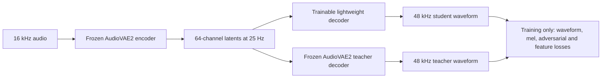

# AudioVAE2 decoder correction plan

**Latest result:** The subsequent controlled comparison used a 0.99 target and passed on every nonquiet fitted crop with waveform-only training. This establishes small-set learnability, while held-out quality still fails. See the [completed comparison](../convnext-objective-comparison/results.md) for the current result and remaining work; earlier diagnostic status below is retained as history.

9 September 2026. Branch: `Convnext`. The completed 10,000-step run is preserved as the baseline.

**Execution update:** The correction implementation and bounded 500-step H100 diagnostic are complete. The diagnostic showed improved waveform learning but failed its reconstruction gate. Larger training remains stopped. See [implementation and measured results](implementation-results.md) for the current status and the proposed next investigation. The steps below describe the correction plan, not a claim that quality has passed.

**Updated acceptance and next experiment:** The user requested a stricter 0.95 waveform-cosine target. It is now implemented locally for each nonquiet crop. The [next-step protocol](next-steps.md) supersedes the older 0.9 criterion and informal follow-up below. Historical reports retain the criteria used when they were generated.

The recommendation is to keep the full lightweight decoder and complete its training recipe. Our implementation already contains the released Supertonic 3 decoder's ten ConvNeXt blocks, dilation pattern, channel widths, GELU, residual scaling, nonlinear PReLU head and direct waveform assembly. The missing quality components are principally in training. The audit does not justify shrinking the model, switching the encoder or adding expensive synthesis stages.

The user's latest instruction authorizes including all documented decoder-relevant components and proceeding with this correction plan. Sustained training follows the correctness and real-waveform learning gates below.

**What STFT means here**

The inference decoder creates waveform samples with learned projections and a reshape. It has no inverse STFT. Training can still apply an STFT to the generated and target waveforms to measure error. Mel losses and spectral discriminators use this analysis during training; they do not become part of the deployed decoder.

The teacher supplies the target sound and stays frozen. It does not automatically transfer its trained decoder weights or teach phase and amplitude when the objective neglects them.

The latent interface is shared exactly: `z = frozen_encoder(audio)`, `target = frozen_decoder(z)`, and `prediction = student_decoder(z)`. Both decoders receive the same cached raw 64-channel posterior means at 25 Hz. We are learning the decoder mapping, not predicting a second latent representation. Consequently, a latent-matching loss is unnecessary while the encoder remains frozen. The internal phase adapter is part of the student decoder; it does not change the latents accepted by the codec API.

**Evidence and limits**

The current official Hugging Face vocoder was checked at revision `3cadd1ee6394adea1bd021217a0e650ede09a323`. Its SHA-256 matches our previously downloaded graph. The official GitHub code runs this exported model. These releases establish the forward computation, but do not publish a complete V3 training program. [Official V3 assets](https://huggingface.co/Supertone/supertonic-3/tree/3cadd1ee6394adea1bd021217a0e650ede09a323/onnx), [official inference code](https://github.com/supertone-inc/supertonic/blob/main/py/helper.py).

The paper specifies two decoder BatchNorm sites and mel reconstruction with multi-period and multi-resolution discriminators plus feature matching. Its reported quality evaluates the combined system, not a separate gain for each component. The precise V3 training settings are not recoverable from that result. [Paper, architecture and optimization appendices](https://arxiv.org/html/2503.23108v3#A1.SS1).

| Component | What we verified in our student | Action |
| --- | --- | --- |
| Ten causal depthwise ConvNeXt blocks | Present; 512 channels, 2048 expansion | Keep all ten |
| Dilations, LayerNorm, GELU, LayerScale and residual paths | Present and matched to the graph | Preserve |
| Kernel-3, 512-to-2048 head, shared PReLU and waveform projection | Present | Preserve the complete nonlinear head |
| Training normalization | No stem BatchNorm; final learned affine has no running statistics | Add masked training BatchNorm at the two documented sites; freeze and fold for deployment |
| Input and output adaptation | Raw 64-channel AudioVAE2 latents; four internal phases; 480 samples per internal frame | Preserve the required AudioVAE2 interface |
| Mel, adversarial and feature-matching training | Absent from the completed recipe | Implement all three |
| Snake, iSTFT, GRN or additional progressive upsampling | Absent from the inspected V3 graph as well | No evidence that these are missing quality stages |

The graph directly proves final BatchNorm. The stem may contain folded normalization; the exported biased convolution alone cannot establish that history. Our two-site training change is supported by the paper, not by guessing anonymous ONNX initializer names. The fixed encoder, latent adapter and sample rates remain our intentional adaptation. [Full layer comparison](supertonic3-decoder-comparison.md).

**1. Correct the loss and target contract**

The old objective gave the exact teacher a nonzero score of 21.604 because its heavily weighted original-recording branch asked for a different target. On diagnostic examples, the teacher spectral gradient at the output weights was around 16,000 to 23,000 times larger than the waveform gradient. These are measured defects in the setup, not reasons to wait for another arbitrary loss threshold. [Completed audit](../convnext-audit/training-audit.md).

Use the same deterministic 48 kHz teacher waveform for reconstruction, discriminator real examples and feature matching. Initially set original 16 kHz reference supervision to zero. Keep the original recording for independent quality evaluation. This gives exact teacher imitation zero reconstruction error; adversarial loss remains a separate quantity with its own nonzero equilibrium.

Implement true multi-resolution mel loss and a phase-sensitive waveform anchor. The proposed waveform term is mean absolute sample error divided by the detached target RMS with a finite silence floor. This changes error weighting without rescaling, realigning or normalizing the generated sound. Log raw waveform L1 and RMS error as well, so normalization cannot conceal lost amplitude.

For mel analysis, explicitly pin sample rate, FFTs, Hann windows, hops, filterbank convention, frequency range, magnitude versus power, log compression, epsilon and averaging axes. Use full 48 kHz teacher bandwidth. Our starting implementation uses magnitude mel features with both linear and log reconstruction terms, Slaney filters and per-example means; these details are our declared choices where the publication is incomplete. The old coefficient 45 must not be transplanted onto a different reduction.

Use an EnCodec-style gradient balancer to prevent one loss scale from overwhelming another. Start reconstruction with equal target gradient shares for the waveform and mel branches, then inspect actual parameter gradients at the adapter, a middle block and output head. Output-gradient balance does not guarantee equal parameter updates, especially with Muon. Track both scales and gradient directions, handle zero norms explicitly and reject nonfinite updates. [Meta's reference balancer](https://github.com/facebookresearch/encodec/blob/main/encodec/balancer.py).

All teacher tensors are detached. Gradients remain connected through the student waveform and its spectral analysis. The teacher checkpoint, encoder, posterior convention and target-cache identity stay pinned.

Teacher target generation will use bounded batches of similarly sized complete utterances. Right padding is removed according to each utterance's own latent and valid waveform lengths. Before batching is enabled, compare actual serial and batched encoder latents and decoder waveforms; require both the declared absolute-error limit and at least 70 dB numerical agreement by relative RMS. A failed check retains serial target generation and records the reason. This is target generation with frozen weights, not a teacher weight update. Cache those targets so the fixed-set diagnostic does not rerun the teacher every optimizer step.

**2. Complete normalization and perceptual training**

Add BatchNorm after the stem and after the block stack, using our own statistics and parameters. Keep the ten existing per-frame LayerNorms. Batch statistics must exclude artificial right padding and context-only frames from their estimation. They must not count short clips as padded silence.

Dynamic BatchNorm uses batch/time statistics during training, so training behavior is not strictly causal. Deployment and acceptance tests must use fixed statistics. Freeze the statistics before the final reconstruction check and perceptual finishing stage, and fine-tune with that exact fixed-statistics function. Also check that changing unrelated batch members cannot change an evaluated clip.

At export, fold the two fixed affine transforms into neighboring convolutions. Our replicate padding permits this without an extra boundary correction. Verify the folded and unfurled functions, reset streaming state after conversion, and require unchanged output lengths and chunk boundaries. This preserves the deployed computation pattern. A legacy configuration must remain loadable to inspect the old checkpoint. This normalization change is a plausible improvement, not a proven explanation for the failed run.

Implement the complete published discriminator families, adversarial objective and intermediate feature matching. The selected recipe uses MPD periods 2, 3, 5, 7, 11; MRD FFTs 512, 1024, 2048; reconstruction FFTs 1024, 2048, 4096 with 64, 128, 128 mel bands; and least-squares labels real +1, fake -1, generator +1. Feature and discriminator reductions are explicit per-element and per-network means. [Paper, optimization appendix](https://arxiv.org/html/2503.23108v3).

Use aligned valid 48 kHz crops from teacher and student. Do not label upsampled 16 kHz originals as real full-band audio. On discriminator updates, detach student outputs. On generator updates, freeze discriminator parameters while allowing gradients through its operations; detach the real feature targets. Discriminators are newly initialized and are never exported.

Begin with reconstruction only to establish that the decoder can reproduce teacher waveforms. Then introduce adversarial and feature-matching contributions gradually. Proposed final target gradient shares are waveform 30%, mel 40%, feature matching 20%, adversarial 10%, subject to the bounded calibration gate. These are pilot settings, not claimed Supertonic hyperparameters. Reconstruction metrics remain separate from GAN training losses.

**3. Prove waveform learning before sustained training**

First verify the exact-teacher, silence, attenuated-teacher and polarity-reversed-teacher controls. Exact matching must have zero reconstruction error. Polarity inversion leaves magnitude spectra unchanged, so the phase-sensitive term must detect it. Check every teacher parameter remains frozen and every intended student parameter receives finite gradients.

Run one deliberately small fixed-set overfit diagnostic with the full model, using real teacher targets from speech and expressive sounds. Repetition here is a disclosed diagnostic exception, not a repeated main training epoch. Keep those clips out of later validation and main exposure counts. The proposed maximum is 500 optimizer updates; failure stops the pilot and produces diagnostics instead of launching a longer run.

Proposed acceptance criteria on voiced, non-silent diagnostic crops, evaluated with frozen normalization statistics: waveform error at most half the silence-baseline error; RMS within 1 dB of the teacher; and zero-lag waveform cosine at least 0.9. Report each clip, including quiet and expressive cases, rather than passing on a favorable mean. These are strict trainability gates, not claimed universal perceptual-quality thresholds. The objective and measurements must first be validated against the controls.

Use a fresh student and fresh optimizer state for this corrected recipe. Preserve the old model as a comparison; do not describe changed losses and normalization as an exact resume. Retain the existing Muon/AdamW generator split initially, because its wiring passed the audit. Use AdamW for the new discriminators. Record a short warmup and explicit decay schedule in the new run instead of silently inheriting the old constant schedule.

After that diagnostic passes, run a bounded pilot on unused main-data windows. Check held-out reconstruction and audio samples before permitting sustained perceptual training. Do not treat either a lower aggregate GAN loss or reaching 10,000 steps as proof of quality.

**4. Repair exposure, validation and monitoring**

The completed run consumed 371.70 unique scored hours. About 139.16 usable hours remain, heavily skewed toward English and expressive data. We cannot honestly call another broad run on the same consumed windows new data. Maintain a cross-run ledger of scored audio intervals; never silently wrap depleted source queues.

The first unused-data pilot is capped at 20 scored hours: LibriSpeech 10 hours, FLEURS 5 hours, IndicVoices 1 hour and expressive sources 4 hours, after reserving development and diagnostic clips. These quotas are constrained by the actual remaining intervals. [Data and validation plan](data-and-validation-plan.md). It establishes whether the repaired recipe learns; it cannot establish all-language quality where language queues are exhausted. Larger multilingual training needs validated fresh replenishment. Pinned FLEURS metadata suggests substantial additional capacity, but that estimate is not downloaded audio and does not guarantee fresh material in every language.

Reserve development data before selecting new training windows. Add official FLEURS dev coverage and a separate Indic panel; the old dev set included neither. Use publisher split guarantees where speaker IDs are unavailable and describe that limit. Exclude known speaker/session overlaps when metadata permits. Include quiet speech, laughter, crying, shouting and whistling, plus fixed beginnings and interior positions. Report language and condition summaries alongside the aggregate.

TensorBoard will show teacher waveform error, mel error, RMS, phase-sensitive diagnostics, discriminator/feature losses, gradient shares, learning rates and achieved data exposure separately. Run inexpensive checks on a fixed sentinel panel during training; reserve the full PESQ, STOI, UTMOS, DNSMOS and listening comparison for milestone checkpoints. MUSHRA requires human ratings and is not an automatically generated score.

The paired final comparison uses the original teacher, corrected student and preserved baseline on identical clips. Full-file versus streaming waveform agreement, exact sample accounting and no missing chunks are mandatory. Validate CPU decoder RTF with one thread at matched 80 and 160 ms calls on Apple, Intel and AMD only after quality passes.

**Implementation and rollout**

| Area | Planned change | Required evidence |
| --- | --- | --- |
| Student model and export | Two masked BatchNorm sites, fixed-statistics mode and folding; legacy loading retained | Padding, batch independence, fold parity, causal prefix and streaming checks |
| Distillation losses | True mel plus waveform supervision; explicit scales and gradient balancing | Oracle controls, masking, finite gradients, component and parameter-gradient reports |
| Discriminators | MPD, MRD, least-squares training and feature matching | Correct detach boundaries, valid crops, finite generator/discriminator updates |
| Trainer | Reconstruction then perceptual stage; immutable run identity, checkpoints and separate metrics | Correct state transitions, resume identity and no teacher updates |
| Sampler and validation | Source quotas, global consumed-interval exclusion, representative fixed dev set | Actual exposed hours, no replacement, no silent depletion renormalization |
| Runpod launch | Bounded correctness and trainability gates before larger training | Saved pass/fail report and inspectable samples |

The production codec stays intact while this work proceeds in the experimental branch. No Supertonic learned weights, latent statistics or encoder are imported.

Keeping inference cheap is realistic for these changes: mel analysis, discriminators, feature matching and balancing are training-only, while fixed normalization can be folded. Equal Supertonic RTF is not yet established. Our body operates at 100 Hz versus about 86.13 Hz for its released decoder, so it runs approximately 16% more often per audio second. Teacher-level quality and the final CPU speed both remain acceptance targets, not guarantees from adopting the architecture.
